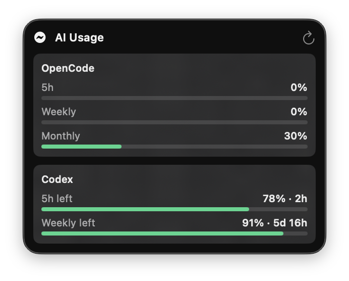
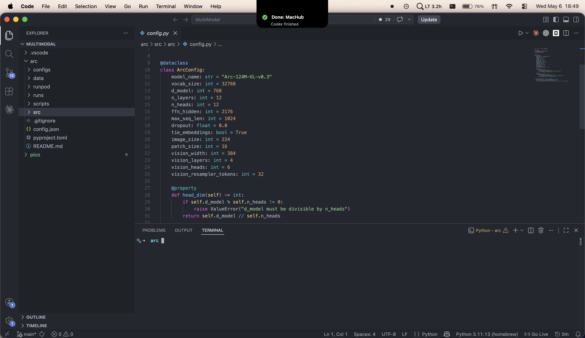

# Coding Notificator

A small macOS menu bar app for keeping an eye on coding agents without babysitting the terminal.

Coding Notificator watches local OpenCode, Codex, and Claude Code activity, shows compact notch-style status updates, plays lightweight sounds for important state changes, and exposes a clean AI usage popover from the menu bar.



## What It Does

- Shows OpenCode, Codex, and Claude Code usage in a compact menu bar popover.
- Reads Codex 5h and weekly limits through the local Codex app-server when available.
- Reads Claude Code 5h and 7d limits through a Claude status-line bridge.
- Tracks OpenCode 5h, weekly, and monthly usage from the local OpenCode database.
- Shows notch-style overlays for finished, failed, and input-required agent states.
- Uses separate sounds for completion, required input, and failure.
- Keeps running/busy events silent so repeated OpenCode status updates do not become noisy.



## Usage Panel

The menu bar panel keeps the app intentionally small:

- **OpenCode**: `5h left`, `Weekly left`, and `Monthly left`.
- **Codex**: `5h left` and `Weekly left`, with reset countdowns when Codex exposes them.
- **Claude Code**: `5h left` and `7d left`, populated after Claude Code sends status-line data.
- Progress bars shift from healthy green to warning amber to critical red.

## Agent Notifications

The app listens for local event files written by OpenCode, Codex, and Claude Code helper workflows and turns them into native macOS feedback:

- `done` / `session.idle`: completion overlay and sound.
- `requires_input` / `permission.asked`: input-required overlay and sound.
- `failed` / `session.error`: failure overlay and sound.
- `running` / `busy`: state update only, no sound.

## Claude Code Setup

Claude Code exposes live usage in its status-line JSON and important lifecycle events through hooks. The helper scripts in `scripts/claude/` bridge those into Coding Notificator:

- `codingnotificator_statusline.py` writes `~/Library/Application Support/CodingNotificator/claude-usage.json`.
- `codingnotificator_hook.py` writes permission, input, completion, and failure events to the same app event file used by other agents.

Install the bridge into Claude Code:

```bash
mkdir -p ~/.claude
cp scripts/claude/codingnotificator_*.py ~/.claude/
chmod +x ~/.claude/codingnotificator_*.py
```

Then add the scripts to `~/.claude/settings.json` as a status line and hooks. The app starts showing Claude usage after the next Claude Code response, because Claude only emits fresh rate-limit data after API activity.

## Building

Open the Xcode project and build the `CodingNotificator` scheme, or build from the terminal:

```bash
xcodebuild -project CodingNotificator.xcodeproj -scheme CodingNotificator -configuration Debug build
```

To install the current debug build into your user Applications folder:

```bash
APP_PATH=$(find ~/Library/Developer/Xcode/DerivedData -path '*/Build/Products/Debug/CodingNotificator.app' -type d | head -1)
ditto "$APP_PATH" ~/Applications/CodingNotificator.app
open ~/Applications/CodingNotificator.app
```

## Notes

This is a local utility. OpenCode usage comes from the local OpenCode database, Codex usage comes from the local Codex app-server when available, and Claude Code usage comes from Claude's local status-line payload after Claude Code runs.
