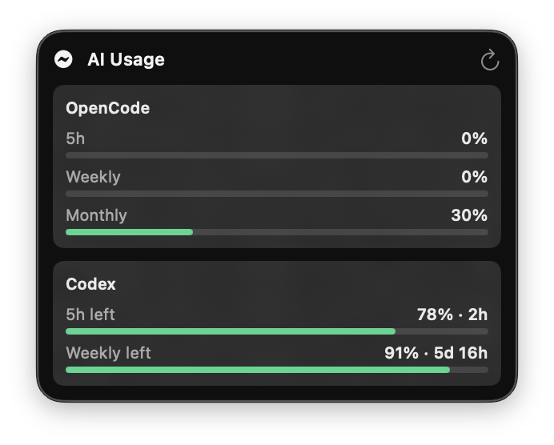
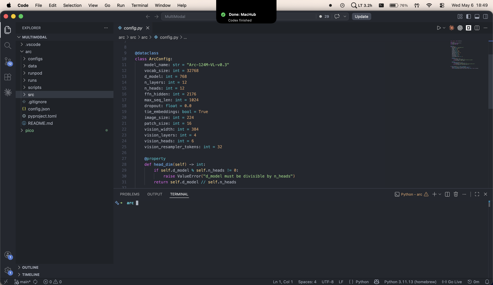

# Coding Notificator

A small macOS menu bar app for keeping an eye on coding agents without babysitting the terminal.

Coding Notificator watches local OpenCode, Codex, and Claude Code activity, shows compact notch updates for completion, failure, and required input, plays distinct sounds for those events, and exposes an AI usage popover from the menu bar.



## What It Does

- Shows OpenCode, Codex, and Claude Code usage in a compact menu bar popover.
- Reads the Codex weekly limit through the local Codex app-server when available.
- Reads Claude Code 5h and 7d limits through a Claude status-line bridge.
- Tracks OpenCode 5h, weekly, and monthly usage from the local OpenCode database.
- Shows a horizontally scrolling notch strip for completed, failed, and input-waiting threads.
- Plays distinct sounds for completion, failure, and required input.
- Ignores running/busy events so active threads do not fill the notch.



## Usage Panel

The menu bar panel keeps the app intentionally small:

- **OpenCode**: `5h left`, `Weekly left`, and `Monthly left`.
- **Codex**: `Weekly left`, selected from the actual seven-day window even when Codex reports it as its primary limit.
- **Claude Code**: `5h left` and `7d left`, populated after Claude Code sends status-line data.
- Progress bars shift from healthy green to warning amber to critical red.

## Agent Notifications

The app listens for local event files written by OpenCode, Codex, and Claude Code helper workflows and turns them into native macOS feedback:

- `done` / `session.idle`: completion overlay and sound.
- `requires_input` / `permission.asked`: input-needed overlay and sound.
- `failed` / `session.error`: failure overlay and sound.
- `running` / `busy`: ignored by the notch.

Each completed, failed, or input-waiting thread has its own item. The notch shows two compact items at once and scrolls horizontally when more are present. Click an item to dismiss it, or double-click the notch to clear the items.

## Claude Code Setup

Claude Code exposes live usage in its status-line JSON and important lifecycle events through hooks. The helper scripts in `scripts/claude/` bridge those into Coding Notificator:

- `codingnotificator_statusline.py` writes `~/Library/Application Support/CodingNotificator/claude-usage.json`.
- `codingnotificator_hook.py` writes permission, input, completion, and failure events to the same app event file used by other agents.

Install the bridge into Claude Code:

```bash
mkdir -p ~/.claude
cp scripts/claude/codingnotificator_*.py ~/.claude/
chmod +x ~/.claude/codingnotificator_*.py
```

Then add the scripts to `~/.claude/settings.json` as a status line and hooks. Register `codingnotificator_hook.py` for `PermissionRequest`, `Elicitation`, `Stop`, and `StopFailure`. The app starts showing Claude usage after the next Claude Code response, because Claude only emits fresh rate-limit data after API activity.

## Building

Open the Xcode project and build the `CodingNotificator` scheme, or build from the terminal:

```bash
xcodebuild -project CodingNotificator.xcodeproj -scheme CodingNotificator -configuration Debug build
```

To install the current debug build into your user Applications folder:

```bash
APP_PATH=$(find ~/Library/Developer/Xcode/DerivedData -path '*/Build/Products/Debug/CodingNotificator.app' -type d | head -1)
ditto "$APP_PATH" ~/Applications/CodingNotificator.app
open ~/Applications/CodingNotificator.app
```

## Notes

This is a local utility. OpenCode usage comes from the local OpenCode database, Codex usage comes from the local Codex app-server when available, and Claude Code usage comes from Claude's local status-line payload after Claude Code runs.
